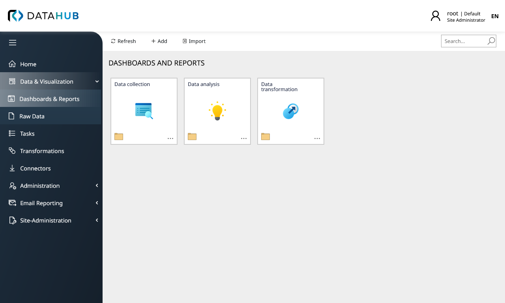

# Raynet One Data Hub
Raynet One Data Hub (previously known as RayVentory Data Hub) integrates various data sources into a holistic overview, which is then normalized and visualized in dashboards and reports. From this, important key figures and therefore action decisions can be derived.

## All data in one central solution
The integration of different data sources and the preparation of clear dashboards are the core functionality of the Technology Asset Inventory solution Raynet One / RayVentory. Due to the high flexibility and automatability, you achieve a fully comprehensive overview of your IT infrastructure, such as information about your IT devices and cloud usage, in the shortest possible time.

By leveraging existing data sources, vulnerabilities and missing data are quickly identified and can be efficiently remediated through Raynet One / RayVentory‘s inventory functionality. As a result, information is provided to the various stakeholders in a targeted way. In doing so, you can independently determine, for example, the level of detail and the right time for providing the information.

### Prerequisities
In order to run this container you'll need docker installed.

* [Windows](https://docs.docker.com/windows/started)
* [OS X](https://docs.docker.com/mac/started/)
* [Linux](https://docs.docker.com/linux/started/)

On Windows, make sure to use Linux Containers, WSL2 is recommended. 

### Usage
The default configuration consists of three containers:
* A database (Microsoft SQL Server Express OR MariaDB)
* Frontend and backend for the Data Hub
* Data Hub Agent

The default configuration is standalone and should work out-of-the-box.

#### Installation with docker-compose
The easiest way to run the image with reasonable default is to use `docker-compose` command.
1. Get the [`docker-compose.yml`](docker-compose.yml) file from this repository, or [`docker-compose_mariaDb.yml`](docker-compose_mariaDb.yml) for MariaDB.
2. In the folder containing the downloaded definition, run the following command: `docker-compose up -d`. 
 
#### First start ####
1. Login to [`http://localhost:80`](http://localhost:80) and use the following credentials:
- Login: `root`
- Password: `raynet`
2. Provide the valid license for the product.
3. After log-in, change your root password and create application users.

#### Installing on Kubernetes Cluster ####
For Kubernetes-related instructions, visit the dedicated [kubernetes section](kubernetes/).

#### Default docker-compose (with SQL Server Express)

    version: "3.7"
    services:
    
      database:
        image: mcr.microsoft.com/mssql/server:2019-latest
        ports:
          - "1434:1433"
        environment: 
          - ACCEPT_EULA=Y
          - SA_PASSWORD=Start123!@#
          - MSSQL_PID=Express
        restart: always
        volumes:
          - sql_data:/var/opt/mssql
    
      web:
        image: raynetgmbh/rayventory-datahub:14.0.5915.129
        ports:
          - "8080:8080"
        depends_on:
          - database
        restart: always
        environment:
          - connectionStrings__System=Server=database,1433;Database=datahub;User ID=sa;Password=Start123!@#;Encrypt=False
          - connectionStrings__ReportDatabase=Server=database,1433;Initial Catalog=master;User ID=sa;Password=Start123!@#;Encrypt=False
          - connectionStrings__Driver=mssql
          - TasksManagement__LogsDirectory=/app/raynet/datahub/task-logs
          - KotlinDirectoryPath=/app/raynet/datahub/kotlin
          - InitialTenantId={72ba6fc2-d5fa-49ee-8281-841e762aea05}
          - Logging__LogLevel__Default=Warning
          - BASEURL=http://localhost:8080
          - TokenManagement__secret=Set-New-Secret-With-Minimum-32-Symbols
          - ASPNETCORE_URLS=http://+:8080
          - ASPNETCORE_HTTP_PORTS=8080
          - Seeding__DefaultApiKey=AHE5M61-MWDM5MQ-KXHNQA0-0ZSNG74
        volumes:
          - ./host-logs:/app/raynet/datahub/task-logs
    
      agent:
        image: raynetgmbh/rayventory-datahub-agent:14.0.5915.129
        depends_on:
          - web
        restart: always
        environment:
          - DataHubUrl=http://web:8080
          - TenantId={72ba6fc2-d5fa-49ee-8281-841e762aea05}
          - KotlinDirectoryPath=/app/raynet/datahub-agent/kotlin
          - DataHubApiKey=AHE5M61-MWDM5MQ-KXHNQA0-0ZSNG74
    volumes: 
      sql_data:

#### Default docker-compose (with MariaDB)

    version: "3.7"
    services:
    
      mariadb:
        image: "mariadb:latest"
        ports:
          - "3307:3306"
        environment:
          MYSQL_ROOT_PASSWORD: raynetRootPassword
          MYSQL_DATABASE: datahub
          MYSQL_USER: raynetUser
          MYSQL_PASSWORD: raynetPassword
        restart: 'always'
        volumes: 
          - /var/docker/mariadb/conf:/etc/mysql
          - mariadb_data:/var/lib/mysql
      web:
        image: raynetgmbh/rayventory-datahub:14.0.5915.129
        ports:
          - "8080:8080"
        depends_on:
          - mariadb
        restart: always
        environment:
          - connectionStrings__System=Server=mariadb,3307;Database=datahub;User ID=root;Password=raynetRootPassword;AllowUserVariables=True;UseAffectedRows=False
          - connectionStrings__ReportDatabase=Server=mariadb,3307;Database=datahub;User ID=root;Password=raynetRootPassword;AllowUserVariables=True;UseAffectedRows=False
          - connectionStrings__Driver=mysql
          - TasksManagement__LogsDirectory=/app/raynet/datahub/task-logs
          - KotlinDirectoryPath=/app/raynet/datahub/kotlin
          - InitialTenantId={72ba6fc2-d5fa-49ee-8281-841e762aea05}
          - Logging__LogLevel__Default=Warning
          - BASEURL=http://localhost:8080 
          - TokenManagement__secret=Set-New-Secret-With-Minimum-32-Symbols
          - ASPNETCORE_URLS=http://+:8080
          - ASPNETCORE_HTTP_PORTS=8080
          - Seeding__DefaultApiKey=AHE5M61-MWDM5MQ-KXHNQA0-0ZSNG74
        volumes:
          - ./host-logs:/app/raynet/datahub/task-logs
        links:
          - mariadb
      agent:
        image: raynetgmbh/rayventory-datahub-agent:14.0.5915.129
        depends_on:
          - web
        restart: always
        environment:
          - DataHubUrl=http://web:8080
          - TenantId={72ba6fc2-d5fa-49ee-8281-841e762aea05}
          - KotlinDirectoryPath=/app/raynet/datahub-agent/kotlin
          - DataHubApiKey=AHE5M61-MWDM5MQ-KXHNQA0-0ZSNG74
    volumes: 
      mariadb_data:

#### The image ####
Raynet One Data Hub is available on docker hub:
* [`https://hub.docker.com/r/raynetgmbh/rayventory-datahub`](https://hub.docker.com/r/raynetgmbh/rayventory-datahub)
* [`https://hub.docker.com/r/raynetgmbh/rayventory-datahub-agent`](https://hub.docker.com/r/raynetgmbh/rayventory-datahub-agent)

You can use tags `12.6` (recommended) or `stable` to get the last 14.0 or the last stable version respectively.

#### Environment Variables
Data Hub:
* `DataHub_ConnectionStrings_System` - The connection string to the database, where the application data is stored
* `DataHub_ConnectionStrings_ReportDatabase` - The connection string to the server, which orchestrates creation of tenant databases.
* `DataHub_ConnectionStrings_Driver` - The type of the underlying database driver (supported values: `mysql` or `mssql` (default))
* `DataHub_InitialTenantId` - The GUID of the initial tenant.
* `BASEURL` - The base URL, that will be used in the web browser to access the content. Should also contain protocol name and the port.

Data Hub Agent:
* `DataHubAgent_DataHubUrl` - The URL to connect to the server. It can reference internal docker services, and should contain the protocol name and the port.
* `DataHubAgent_TenantId` - The tenant ID, assigned to the agent.
          - 
## License Activation ##
Raynet One Data Hub needs a valid license to run. If there is no valid license, Raynet One Data Hub will open the activation screen.

# Documentation
* [Release notes (HTML)](https://docs.raynet.de/raynet-one/datahub/latest/release-notes)
* [Installation Guide (HTML)](https://docs.raynet.de/raynet-one/datahub/latest/installation-guide)
* [User Guide (HTML)](https://docs.raynet.de/raynet-one/datahub/latest/user-guide)

## Find Us
* [Raynet GmbH corporate website](https://raynet.de)
* [Raynet EALM GitHub](https://github.com/raynetEALM)
